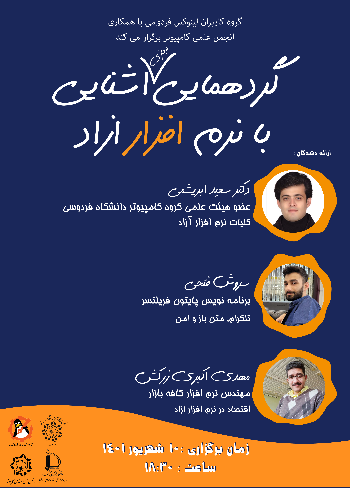

# Free software familiarization conference-2022

Slides and links related to the conference on familiarization with free software

## speakers:
## Saeid Abrishami
##### Assistant Professor of Computer Engineering, Ferdowsi University of Mashhad
---
## [Soroush Fathi](https://github.com/soroushfathi)
##### Freelancer Python developer
---
## [Mahdi Akbari Zarkesh](https://github.com/maze1377)
##### Software Engineer at Cafe Bazaar
